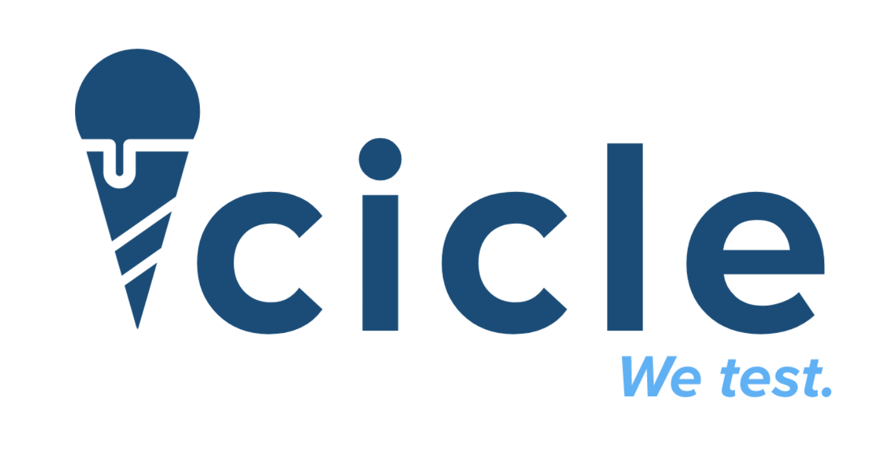

# Icicle


## A JavaScript testing infrastructure, based on rspec and jasmine

**_•• Instructions ••_**

- Download the repo
- Copy `icicle/` and `SpecRunner.html` in your project
- Place your source files and spec files in the `<head>` of SpecRunner.html.

### Example

```html
<!DOCTYPE html>
<html>
  <head>
    <!-- Some stuff in the head... no need to touch it -->

    <!-- Your source files here. -->
    <script src="examples/lib/foo.js"></script>

    <!-- Your tests here -->
    <script src="examples/spec/fooSpec.js"></script>
  </head>
  <body></body>
</html>
```

## Writing tests

```JavaScript
//In fooSpec.js
//tests are written like so

describe('foo', () => {
  
  let foo = new Foo();

  it("has a bar attribute that returns baz", () => {
    expect(foo.bar).toEqual("baz");
  });

});
```

## How to use

Open SpecRunner.html in your favourite browser.
